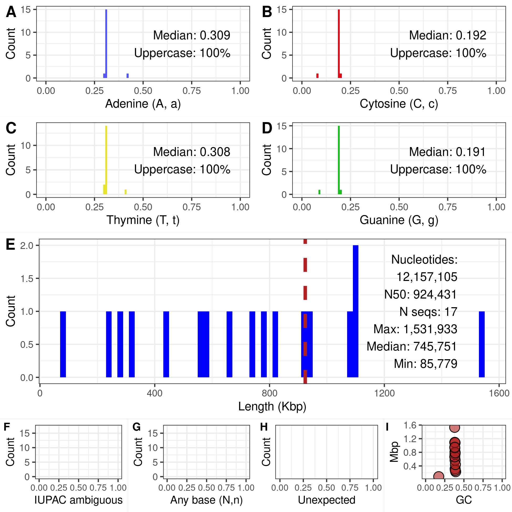

# Table of Contents
1. [fasta2nuccomp](#fasta2nuccomp)
2. [Installation](#installation)
3. [Use_case_1](#use-case-1): command line python
4. [Use case 2](#use-case-2): Calling python from Rmarkdown


## fasta2nuccomp

Summarize the contents of FASTA files.
This project consists of three main files.


- **fasta2nuccomp.py** a python script to summarize a FASTA file
- **fasta2nuccomp.Rmd** an RMarkdown script to create a report including visualization of the FASTA file summary
- **fasta2nuccomp.Rproj** an RStudio project to edit and knit the RMarkdown


The python script fasta2nuccomp.py takes a FASTA file as an argument and produces a per sequence tabular summary of the file.
The RMarkdown file fasta2nuccomp.Rmd demonstrates how to call the python script from R, calculate summary statistics, and create publication quality graphical summaries of the data.
Together these scripts demonstrate how to rapidly summarize FASTA files such as genome sequences.


---





## Installation


In order to use this code the user will need python and R installed on their system.
We also recommend using the integrated development environment [RStudio](https://posit.co/products/open-source/rstudio/).
Please consult the respective project pages to ensure these are installed.

The python script uses Biopython.
Please ensure that this is installed.
The following is an example of what to expect if Biopython is not installed.


```
$ ./fasta2nuccomp.py 
Traceback (most recent call last):
  File "./fasta2nuccomp.py", line 6, in <module>
    from Bio import SeqIO
ModuleNotFoundError: No module named 'Bio'
```


This usually indicates that [Biopython](https://biopython.org/) is not installed.
Please see it's documentation to make sure it is installed correctly.
Note that a system may include several versions of python (including conda environments).
This can create a situation where Biopython, or other dependencies, are installed in one environment but not in the environment a user is attempting to use at any particular time.
This means the user needs to ensure that dependencies are installed into the environment they are attempting to use.


Installation of `fasta2nuccomp` can be accomplished by cloning the GitHub repository as follows.


```
git clone git@github.com:knausb/fasta2nuccomp.git
```

Or downloading a release.
Once on a local machine the scripts should be included in the user's path.


## Use case 1
**command line python**

The python script `fasta2nuccomp.py` can be invoked, using a FASTA or FASTQ file that may be gzipped, as follows.


```
$ ./fasta2nuccomp.py S288C_reference_sequence_R64-2-1_20150113.fsa.gz
```

This should result in the following file.


```
S288C_reference_sequence_R64-2-1_20150113_nuccomp.csv
```

This is the input file name with the FAST[AQ] and any 'gz' extension removed and the suffix `_nuccomp.csv` added.
This file summarizes the contents of the FAST[AQ] file
Processing of this file can be accomplished by following the example code in `fasta2nuccomp.html`.
Note that GitHub does not 'serve' these *.html files so the user will have to view a local copy.
Alternatively, the file `fasta2nuccomp.Rmd` can be compiled, or knit, into *.html using RStudio, or from the command line as follows. 


```
Rscript -e "rmarkdown::render('fasta2nuccomp.Rmd')"
```


## Use case 2
Calling python from Rmarkdown

R can be integrated with python allowing the python script to be run as a part of the Rmarkdown compilation.
This may require configuration that is beyond the scope of this project.
It has been our experience that installing the `reticulate` package will be required.

```
install.packages('reticulate')
```

Adding the below line to your `~/.Rprofile` file can help R know which version of python to use.

```
Sys.setenv(RETICULATE_PYTHON = "~/miniconda3/envs/biopython/bin/python")
```


Once R and python are configured the `fasta2nuccomp.Rmd` file can be modified to evaluate the code chucks containing python code.
This will allow the python code to be called from the Rmarkdown allowing processing to occur in one step.

