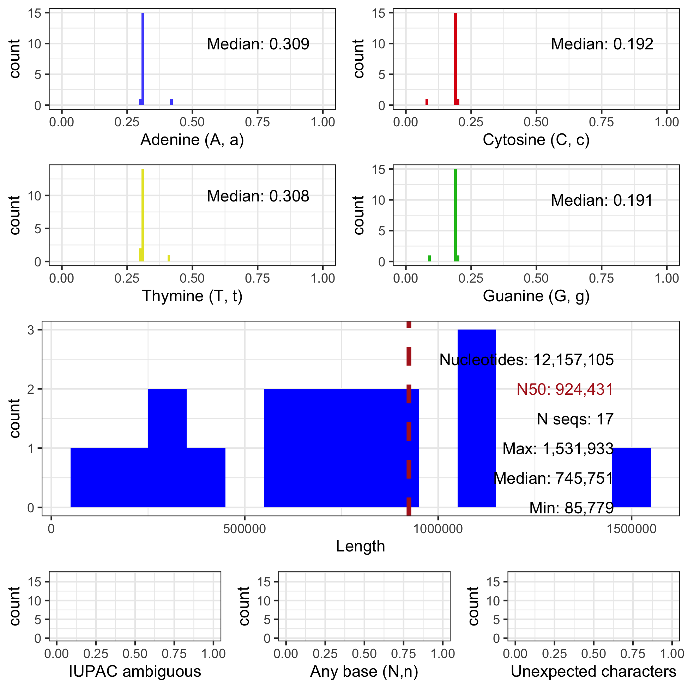

```{r setup, include=FALSE}
knitr::opts_chunk$set(echo = TRUE)
```


## Abstract


Many bioinformatic projects begin with a large FASTA format file, such as a genome.
However, the quality of the contents of these files varies from project to project.
For example, some genomes may include large numbers of ambiguous nucleotides which may present issues to other software used in a project.
This presents a need to rapidly assess the contents of these files.
We present fasta2nuccomp as a tool to query and present summaries of the contents of FASTA files containing nucleotides.
This tool consists of a python script and an RMarkdown document.
The python script can be run on local machines or high performance computing facilities and it rapidly summarizes the nucleotide composition for each sequence in the file.
The RMarkdown providess an example of how this summary can be graphically presented as a report or as publication quality figures.
With fasta2nuccomp we can rapidly assess the content of FASTA format files so we can move on to downstream procedures with confidence in knowing what the file contains.


Keywords: FASTA file, genome announcement, nucleotide composition, quality control.


## Introduction

* **Paragraph thesis statement:**


The results from genomic assembly and analysis workflows frequently results in a large FASTA for mat file.

Bioinformatic data sets, such as genomic data, are sufficiently large that visual inspection is not practical.
This presents a need to summarize and process large data sets for quality control.
Solutions exist for some, but not all steps in workflows.
For example, the software FastQC [@andrews2010fastqc; @bioinformatics2011fastqc] summarizes raw sequencing reads in the FASTQ format that are a typical result from Illumina sequencing.
The trimmomatic [@bolger2014trimmomatic] attempts to remove nucleotides from low quality Illumina sequencing data.
In order to infer whether gene space has been well assembled BUSCO [@seppey2019busco] queries for conserved genes from several databases throughout the phylogenetic tree of life.
Blobtools [@laetsch2017blobtools] uses GC content and read coverage to attempt to improve assemblies.


* **Paragraph thesis statement:**

A commonly reported summary of a genome is the N50 statistic.
This can be calculated by summing the number of nucleotides in an assembly and dividing by two to get the midpoint.
Then sort the sequences from longest to shortest and starting from the longest sequence traverse the sequences until the midpoint of the sequences has been reached.
The length of the sequence that contains the midpoint is the N50.
While this statistic is commonly reported it does have shortcomings, which is perhaps why several alternatives have been proposed.
One shortcoming is that it is a single number that is attempting to summarize millions or billions of nucleotides, so some may see it as an over simplification.
Another is that it is sensitive to the minimum reporting length in fragmented genomes.
Assemblies based on Illumina data, or other fragmented assemblies, typically contain a large number of short sequences.
How short is determined by a minimum length of sequence to report in the final version.
If we take an assembly with a minimum reporting length of 100 bp and remove all sequences that are less than 500 bp it will increase the N50.
This is because we are reducing the number of nucleotides in the assembly by removing short sequences.
The N50 statistic has been very useful but more informative summaries could provide more informative perspectives.


* **Paragraph thesis statement:**

We present fasta2nuccomp, a suite of tools intended to summarize the content of FASTA format files that contain nucleotides.
These scripts consist of a python script that summarizes the FASTA file in a tabular format and an RMarkdown script that numerically and graphically summarize the tabular data.
Together, these scripts provide a rapid way to summarize the contents of FASTA files and present this information in publication quality graphics.


## Methods


The repository fasta2nuccomp contains a python script, an RMarkdown script, example data and example output.
The python script takes a FASTA format file consisting of nucleotides as input.
The python (≥ 3.8.2) script uses biopython [@cock2009biopython] to read in the file and to collect the length, as well as the (case sensitive) number of nucleotides and IUPAC ambiguous nucleotides.
This information is output to a comma delimited text file.
This script can be run independently or can be called from the RMarkdown script.
The RMarkdown [@rmarkdown] script uses R [@R] and reads in the comma delimited text file and summarizes it.
Graphical summaries are made using ggplot2 [@ggplot2] and ggpubr [@ggpubr] and consist of histograms of A, T, G, and C content, length of sequences, IUPAC ambiguity nucleotides (excluding A, C, G, T, and N), undetermined nucleotides (N), as well as a sanity check for unexpected characters.
Numerical summaries are made as well such as the total number of nucleotides, N50, the number of sequences, and the median for these histograms.
Examples are provided on how to output these graphical summaries to \*.png format and publication quality \*.tiff format.
The *Saccharomyces cerevisiae* [genome](http://sgd-archive.yeastgenome.org/sequence/S288C_reference/genome_releases/) [@engel2014reference] has been included as an example and a form of unit test.
Benchmarking was performed on a MacBook Pro with a 2.6 GHz Quad-Core Intel Core i7 CPU and 16 GB 1600 MHz DDR3 RAM.


## Results


* **Paragraph thesis statement:**

The python script "fasta2nuccomp.py" processed the 12 Mbp yeast genome, consisting of 17 sequences, in 0.5 seconds.
This resulted in a comma delimited text file consisting of 18 rows, a header describing the column contents, and a row for each of the 17 sequences in the S288C genome.
This file included a column for the Id of each sequence, it's length, and the number of each nucleotide (A, C, G, T) as well as each ambiguous nucleotide in a case sensitive manner.
The RMarkdown script ```fasta2nuccomp.Rmd``` reads in this tabular data and demonstrates how to create individual plots for information from the output of the python script and how to make a publication quality composite plot summarizing multiple data features.
An example of this plot is presented in Figure 1.
Execution of this RMarkdown script, including checks for dependencies, the call to the python script, and the rendering of graphics, required 7.5 seconds.


```{r fig, echo=FALSE, fig.align='center', fig.cap="Figure 1. A multipanel summary of the yeast S288C genome. Panels A, B, C, and D summarize the per sequence nucleotide content. Panel E summarizes sequence length as well as presents several numerical summaries of sequence length. Panels F, G, and H summarize the per sequence distribution of IUPAC ambiguous and unexpexted characters. Panel I explores the relationship between G/C content and the length of sequences.", out.width = '100%'}

```


## Discussion

* **Paragraph thesis statement:** What is a genome, and in this context

Our perspectives on what a genome is has changed dramatically as our methods of assaying this unseeable phenomenon have changed.
Our earliest perceptions may have included X-ray crystallography [@franklin1953structure].
Cytogenetics brought the perspective of the karyogram to visualize chromosomes, their centromeres, and other features.
Short read genome sequencing presented us with genomes in FASTA format files, text files containing nucleotides organized by chromosome (or sequence), even if the number of sequences in these assemblies greatly outnumbered the expected number of chromosomes.
As genome sequencing and assembly technologies progress we are still presented with these FASTA files, and thus we have a need to describe the contents of these files.
We present fasta2nuccomp, a tool consisting of a python script to summarize a FASTA file and an Rmarkdown script to graphically present these summaries in a report format.
We hope this tool will help summarize genomes for announcements of individual genomic assemblies, summarize numerous genomes to aid pangenomic perspectives, and to also be used internally for quality control to determine if files contain expected data or may have become corrupted somehow.


* **Paragraph thesis statement:** what it does

We present fasta2nuccomp as a suite of tools that utilizes the speed of python and Biopython [@cock2009biopython] with the graphics and RMarkdown report generation of R [@R] to summarize the contents of FASTA files containing nucleotides.
A python script counts the length and nucleotide content for each sequence and saves this information as a comma delimited text file.
This script can be run on a local workstation or be deployed in a high performance computing environment.
The file resulting from this script can either be moved to a local machine, or simply continue to be processed if already working on a local workstation.
These per sequence summaries can be further summarized, such as calculating N50 or the number of sequences in the file, or their distribution can be visualized using graphical tools, such as histograms.
The tool fasta2nuccomp also provides an RMarkdown script to aid in this task.
The RMarkdown can be compiled into several formats, such as \*.html and \*.pdf, to provide a report that includes descriptive text as well as graphics and tables produced in R.
Because the R code to produce summaries is included in this RMarkdown document the end user is also free to customize this example to fit their specific needs.


* **Paragraph thesis statement: conclude, incorporate with existing tools**


Our understanding of what genomes consist of continues to evolve as our ability to assay each genome improves, and as our ability to assay populations of genomes increases. 
As previous explorers sought to documents the plains, mountains, flora and fauna, in genome science we seek to describe the chromosomal content of genomes, their nucleotide composition, the diversity and organizations of protein coding genes as well as regulatory factors and repetitive elements throughout the genomic landscape.
Currently, there are a diversity of summaries that are output from a similar diversity of analytical tools.
Frequently these are output at the end of a time intensive analysis, a step that is typically not justified if only a summary is desired.
Having a rapid tool to calculate many summaries provides a quick way to validate if downloaded data files matched the published description, whether files shared from a colleague still match or may have been corrupted, to genome announcements and pangenomic investigations.
Because the summary table is saved as a text file and all of the code is available other users have the potential to invent combinations of this information that the present authors never imagined.


___


* **Probably should delete (but didn't):**


As the sequencing of genomes becomes more routine the need to summarize the contents of FASTA files becomes increasingly important.
This may be important for assessing the performance of assembly parameters.
Or presenting results in genome announcements, a format which is frequently limited in the number of figures presented.
The software fasta2nuccomp provides a rapid manner to summarize the contents of FASTA files in order to help optimize assembly parameters and to demonstrate the quality of assemblies in a graphical and numerical manner.


* **Paragraph thesis statement:**

A common task for a bioinformatician or genome scientist is that we are presented with a FASTA format file and told it contains a genome, or some other large quantity of data.
Determining the contents of this file, and whether the data is of high quality, is an important part of what may be months of work that are contingent on this file.
For example, this file may be used as a reference for mapping short sequence reads to for variant calling.
If this file contains a high degree of missing data or ambiguous nucleotides, it may affect the ability to map reads to this reference.
Similarly, an investigator may be evaluating the quality of several assemblies for comparative investigations or downstream analyses.
Having a rapid manner to assess the contents of a FASTA file is therefore a crucial first step in genome science.


[@leggett2013sequencing]


# References

