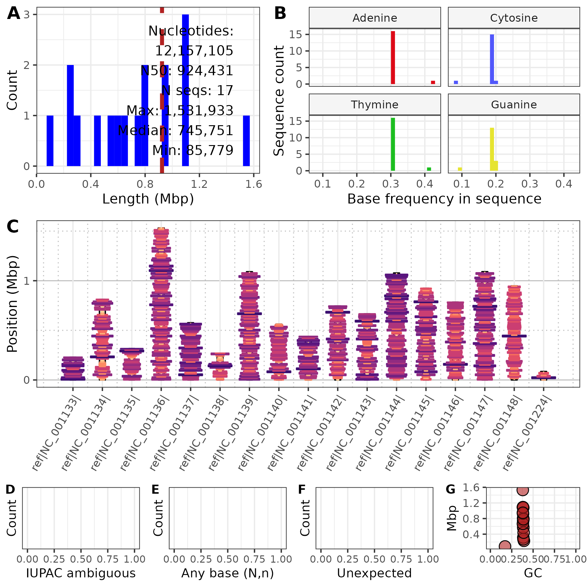

```{r setup, include=FALSE}
knitr::opts_chunk$set(echo = TRUE)
```


---

**To do:**

- Bioinformatics (impact factor: 6.931) - Application Notes 
  - https://academic.oup.com/bioinformatics/pages/instructions_for_authors
  - up to 4 pages; this is approx. 2,600 words or 2,000 words plus one figure 
- export to word?

- Cover letter
- 350 dpi tif figures; single (86 mm) or double (178 mm) column width
- second version of your figures at low-resolution for use in the review 
- Applications notes: Title page, Short Structured Abstract, Text.
- References: The journal follows Oxford SCIMED style.

---


## Abstract


Bioinformatic projects include the management of large FASTA and FASTQ format files, such as a genomes.
The contents of these files, and their quality, varies from project to project and file to file.
For example, some genomes may include large numbers of ambiguous nucleotides which may present issues to other software used to analyze these files.
This presents a need to rapidly determine the contents of these files.
We present nuccomp as a tool to query and present summaries of the contents of FASTA and FASTQ files containing nucleotides.
This tool consists of a python script and an RMarkdown document.
The python script can be run on local machines or high performance computing facilities and it rapidly summarizes the nucleotide composition for each sequence in each file.
The RMarkdown provides an example of how this summary can be graphically presented as a report or as publication quality figures.
With nuccomp we can rapidly determine the contents of FASTA and FASTQ format files so we can move on to downstream procedures with confidence in knowing the contents of these files.


Keywords: FASTA, FASTQ, genome announcement, nucleotide composition, quality control, sequence length distribution.


## Introduction

<div custom-style=DivCol>
Overly wordy intro.
</div>

A genome consists of double stranded DNA packaged into chromosomes.
The DNA contains features such as protein-coding genes, transposable elements, and various types of simple sequence repeats.
Current genome sequencing technology reports this DNA in a text file organized in the FASTA or FASTQ format [@cock2010sanger].
Genomics projects therefore involve managing FASTA and FASTQ files.
Part of this management involves summarizing the contents of these large files in order to validate their contents as well as aid in project organization.
This entails collection of summaries of the FASTA files from the various workflow outputs.
A significant amount of project time is invested in determining which summaries are available from which output and how to present this information.


<div custom-style=DivCol>
Do we need a table of tools?
Column 1: Software name. Column 2: Author.
</div>


Tools for summarizing bioinformatic files exist, but they are currently distributed among many software packages designed to work on various file formats.
For example, the software FastQC [@andrews2010fastqc] summarizes raw sequencing reads in the FASTQ format that are a typical result from Illumina sequencing.
The trimmomatic [@bolger2014trimmomatic] attempts to remove nucleotides from low quality Illumina sequencing data.
In order to infer whether gene space has been well assembled BUSCO [@simao2015busco] queries for conserved genes from several databases throughout the phylogenetic tree of life.
Blobtools [@laetsch2017blobtools] uses GC content and read coverage to attempt to improve assemblies.
Some of these tools are not specific to FASTA or FASTQ format data, or may be a part of a more computationally expensive analysis that may be undesirable to repeat if only a summary is desired.
A solution specific to data in the FASTA and FASTQ format that provides several summaries of the data, examples of the presentation of these summaries, as well as the flexibility to allow the end user to customize these summaries would aid the management of genomics projects as well as the presentation of this information in genome announcements and pangenomic investigations.


<div custom-style=DivCol>
Is nuccomp a 'suite' of tools? 
There are two python scripts (nuccomp.py, motif_counter.py) which are called by an RMarkdown document.
Perhaps this needs some sort of clarification?
</div>


We present nuccomp, a suite of tools intended to summarize the contents of FASTA and FASTQ format files that contain nucleotides.
These tools consist of python scripts that summarize FASTA and FASTQ files in a tabular format and an RMarkdown script that numerically and graphically summarizes the tabular data.
Together, these scripts provide a rapid way to summarize the contents of FASTA and FASTQ files and presents this information in publication quality graphics, as well as reports for internal use.
The use of RMarkdown not only provides an example of how to present the data in a visual format, it also provides a working example for how the end user can customize its presentation.


## Methods

<div custom-style=DivCol>
DNA? No RNA? Amino acids? These are different 'alphabets' that would need to be handled differently.
However, RNA-Seq is 'DNA' sequencing, is that the question?
</div>


The GitHub repository nuccomp (https://github.com/knausb/nuccomp) contains two python scripts, an RMarkdown document, example data, and example output.
The python scripts takes a FASTA or FASTQ format file, consisting of DNA nucleotides, as input.
The outputs from the python scripts are summarized graphically and presented as formatted tables using the RMarkdown document.
The RMarkdown is compiled, or 'knit', to an html document suitable for internal reports.
Output can also be compiled to other formats supported by RMarkdown (html, pdf, docx; @rmarkdown) and ggplot (\*.png, \*.tiff, and other formats; @ggplot2).


The python script nuccomp.py takes as input a FASTA or FASQ format file, which may or may not be compressed with gzip, as input.
The python (≥ 3.8.2) script uses biopython (≥ 1.79; @cock2009biopython) to read in the file and to collect the length, as well as the (case sensitive) number of nucleotides and IUPAC ambiguous nucleotides.
This information is output to a comma delimited text file.
This script may be run independently or may be called from the RMarkdown document.


<div custom-style=DivCol>
Clarify that motif_counter.py queries for a regex motif.
</div>

<div custom-style=DivCol>
Add formula for scaling and centering.
</div>


The python script motif_counter.py divides each sequence in a FASTA or FASTQ file into windows of user specified length and then counts the number of motifs found with a regular expression within each window.
The python (≥ 3.8.2) script uses biopython (≥ 1.79; @cock2009biopython) to read in the file and custom python to divide each sequence into windows and count the number of times a regular expression is matched within each window.
This count is converted to a rate by dividing each count by it's window size, scaled by subtracting the minimum and dividing by the maximum (after subtracting the minimum).
Creating a rate (motifs per position) helps to accommodate the last window of each sequence which is expected to be smaller than the user specified window size.
This scaled rate is then inverted by subtracting it from one and is reported in the BED format output as column 5, the 'score'.
The coordinates for each window, the count, and score are reported in a BED format file.


$$
scale = x-min(x)  \\
scale = scale / max(scale) \\
scale = 1 - scale
$$


The RMarkdown [@rmarkdown] document uses R [@R] and reads in the comma delimited text file resulting from nuccomp.py and the BED file from motif_counter.py and summarizes them.
Graphical summaries are made using ggplot2 [@ggplot2] and ggpubr [@ggpubr] and consist of histograms of A, T, G, and C content, length of sequences, IUPAC ambiguity nucleotides (excluding A, C, G, T, and N), undetermined nucleotides (N), as well as a sanity check for unexpected characters.
Numerical summaries are made as well such as the total number of nucleotides, N50, the number of sequences, and the median for these histograms.
Examples are provided on the GitHub repository to demonstrate how to output these graphical summaries to \*.png format and publication quality \*.tiff format.


The *Saccharomyces cerevisiae* genome (http://sgd-archive.yeastgenome.org/sequence/S288C_reference/genome_releases/; @engel2014reference) has been included as an example and a form of unit test.
In addition, the potato (*Solanum tuberosum*; GCA_001642375.1), hemp (*Cannabis sativa*; GCF_900626175.2), mint (*Mentha longifolia*; GCA_001642375.2), rice (*Oryza sativa*; GCF_001433935.1) cottonwood (*Populus trichocarpa*; GCF_000002775.5), hazelnut (*Corylus avellana*; GCA_901000735.2), and *Arabidopsis thaliana* (GCF_000001735.4) genomes were used for benchmarking.
Benchmarking was performed on computer using an Intel(R) Core(TM) i7-2600K CPU @ 3.40GHz CPU running Ubuntu 2022.04.2 LTS and R 4.3.0.
The repository nuccomp is currently available on GitHub [@knausb2023].


## Results

The python script "nuccomp.py" processed the 12 Mbp yeast genome, consisting of 17 sequences, in less than 1 second (large genomes consisting of more nucleotides and/or sequences should require more time).
This resulted in a comma delimited text file consisting of 18 rows, a header describing the column contents, and a row for each of the 17 sequences in the S288C genome.
This file included a column for the 'ID' of each sequence, it's length, and the number of each nucleotide (A, C, G, T) as well as each ambiguous nucleotide all in a case sensitive manner (to accommodate masking).
The python script "motif_counter.py" summarized the yeast genome into windows into counts of the motif 'CG' and reported this to a BED format file.
The RMarkdown script ```nuccomp.Rmd``` read in this these data, demonstrated the creation of individual plots from output of the python scripts, including a publication quality composite plot summarizing multiple data features.
An example of this plot is presented in Figure 1.
Execution of the RMarkdown script, including checks for dependencies, calls to the python scripts, and the rendering of graphics, required less than 10 seconds.


```{r fig, echo=FALSE, fig.align='center', fig.cap="**Figure 1.** Summary of the yeast S288C assembly (R64-2-1_20150113). Panel A is the distribution of sequence lengths. Panel B presents the distribution for per sequence, nucleotide frequencies. Panel C is an ideogram presenting the lengths (y-axis) of sequences. Each sequence is partitioned into 15 kbp windows for which the width and color were determined by the inverse scaled count of the motif 'CG' within each window. Panels D, E, and F summarize the occurrence of IUPAC ambiguous nucleotides (wWsSmMkKrRyY), any nucelotide (nN), and any unexpected nucleotides on a per sequence basis. Panel G presents the relationship between the length of each sequence and it’s G/C content.", out.width = '70%'}

```


<div custom-style=DivCol>
Methods should be past tense???
</div>

In order to demonstrate the convenience of nuccomp, it was tested on several publicly available genomes.
The potato (*Solanum tuberosum*) genome, with a size of 705 Mbp and an N50 of 1.3 Mbp, required 46.6 seconds.
The hemp (*Cannabis sativa*) genome, consisting of 876 Mbp with an N50 of 91 Mbp, required	45.7 seconds.
The mint (*Mentha longifolia*) genome, consisted of 468 Mbp and an N50 of 37 Mbp, required 29.0 seconds.
The rice (*Oryza sativa*) genome, consisted of 374 Mbp and an N50 of 29 Mbp, required 25.1 seconds.
The cottonwood (*Populus trichocarpa*) genome, consisted of 392 Mbp and an N50 of 19 Mbp, required 24.6 seconds.
The hazelnut (*Corylus avellana*) genome, consisted of 369 Mbp and an N50 of 36 Mbp, required 23.7 seconds.
The *Arabidopsis thaliana* genome, consisted of 119 Mbp and an N50 of 23 Mbp required 12.4 seconds.
Processing time included the running of python code and compiling ('knitting') the RMarkdown, including text input and graphics rendering.
Benchmarking results can be found at the GitHub repository (@knausb2023) in the directory 'benchmarks'.


## Discussion

<div custom-style=DivCol>
This paragraph is a great summary! This could be the first paragraph in the intro!
</div>

Genomic investigations typically begin with the management of FASTA and FASTQ format files, either produced by the investigator or aggregated from existing databases.
The repository nuccomp consists of a suite of tools that utilizes the speed of python and Biopython [@cock2009biopython] with the graphics and statistical resources of R [@R] combined with RMarkdown [@allaire_etal2021] for report generation to summarize the contents of FASTA and FASTQ files containing nucleotides.
The repository nuccomp provides a rapid solution to help inventory the contents of these files and presents this information in graphical and tabular forms.


The use of an RMarkdown document facilitates the summary of the data and also provides a high level code example for the summaries made.
This RMarkdown document is a text file that is compiled, or 'knit', into several formats, such as \*html or \*pdf.
The text file includes text as well as code chunks, as an attempt at literate programming.
This means that the N50 summary statistic in the report includes the code used to generate the summary, providing transparency and educational value.
Similarly, the graphical summaries include code examples for how the plots were generated.
Because the summary table produced by nuccomp is saved as a text file, users have the potential to invent combinations of this information that the present authors haven't imagined.
It is hoped that providing this functionality will allow users to create their own innovations derived from this foundation.


The existing software QUAST [@gurevich2013quast] similarly summarizes assemblies by making it's own summaries as well as aggregating information from other software.
This makes it a feature rich option relative to nuccomp; however this richness comes with a performance cost.
The simplicity of nuccomp lends itself to efficient execution time.
This simplicity also lend itself to other applications.
For example, we've begun using nuccomp.py to summarize long-read (PacBio) sequencing libraries after receiving them from sequencing centers and prior to assembly as a form of quality control.
Users interested in a rich set of reports may enjoy QUAST, while users interested in simplicity and R code that they can modify may enjoy nuccomp.
We hope many users will appreciate both options for their respective strengths.


<div custom-style=DivCol>
KV: Not sure what the intended message is here. There appear to be several ideas mixed together. Raw data fastq files from sequencing aren't by themselves "benchmarks of quality." Raw data downloaded from a data repository like the NCBI SRA can be vetted with nuccomp. 

BK: Trying too hard to finish strong?
</div>


The study of genomics could currently be described as the study of biological sequence files in the FASTA and FASTQ formats.
These files are acquired through data centers and sequencing consortia as benchmarks of quality and to build upon our existing knowledge base.
These files are also  generated at multiple steps during research projects, such as receiving sequence libraries from a sequencing center, the result of assembling these sequences, as well as any results from attempts at scaffolding these assemblies into more contiguous representations of chromosomes and genomes.
Through providing nuccomp as a high level solution, using RMarkdown, it is hoped that this will empower investigators to not only prepare reports and summaries as demonstrated here, but will also provide a foundation that inspires users to innovate their own representations of genomic information.


## Acknowledgements

This work was supported by OregonCBD (Independence, Oregon, USA) through a gift to the Oregon State University Foundation.


## References


